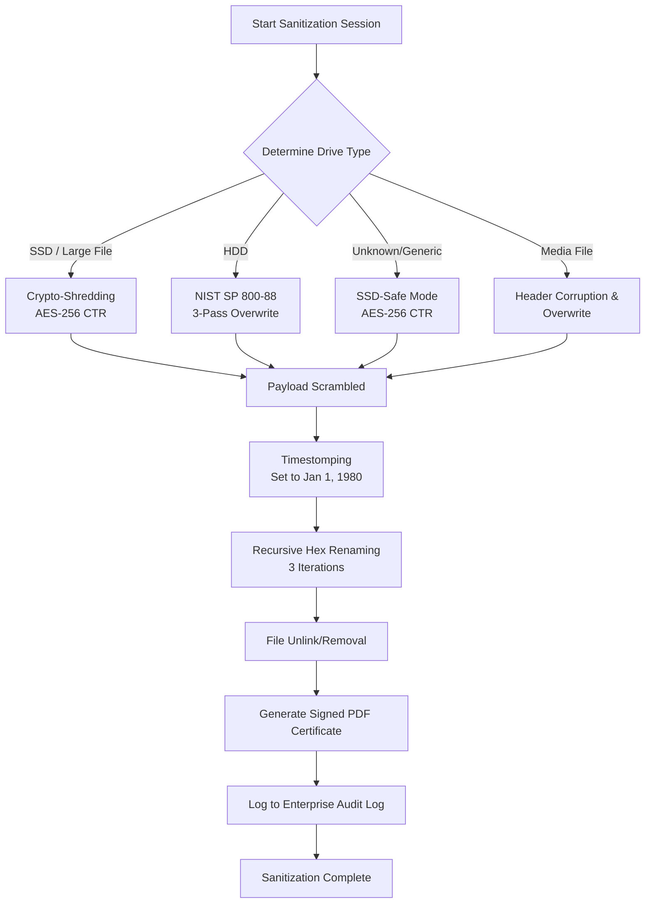

# 🛡️ Secure Data Wiping (SDW) - Enterprise Edition

[](https://www.python.org/)
[](https://github.com/devivaddadi/secure_data_wiping)
[](LICENSE)
[](https://github.com/devivaddadi/secure_data_wiping)

An enterprise-grade, context-aware file and directory sanitization tool. Engineered with a beautiful, modern **CustomTkinter** GUI, the **Secure Data Wiping (SDW)** system dynamically adapts its destruction algorithms based on the target storage hardware (SSD vs. HDD), provides multi-layered file destruction (data overwriting, header corruption, timestomping, and recursive file obfuscation), generates cryptographic certificates of destruction, and maintains audit-ready sanitization logs.

---

## 🚀 Key Features

*   **🔍 Context-Aware Sanitization:** Dynamically queries system partitions (via PowerShell on Windows and `df`/`lsblk` on Linux) to determine physical media type (SSD vs. HDD) and adaptively adjusts the wiping profile.
*   **⚙️ Advanced Erasure Protocols:**
    *   **NIST SP 800-88 3-Pass:** For Hard Disk Drives (Pass 1: Zeros, Pass 2: Ones, Pass 3: Secure Cryptographic Pseudo-Random data).
    *   **Crypto-Shredding (AES-256 CTR):** For SSDs and large archives, rendering data completely unreadable by encrypting the payload with a one-time key that is immediately destroyed.
    *   **Header Corruption & Overwrite:** High-speed structure destruction tailored for media files.
*   **🕵️ Metadata Obfuscation & Timestomping:** Erases forensic footprints by truncating files to zero bytes, resetting timestamps to an arbitrary past date (Jan 1, 1980), and performing 3 iterations of random renaming before final file deletion.
*   **📜 Digital Certificates of Destruction:** Generates a professional, print-ready PDF certificate (verified with a SHA-256 digital signature of the wipe session metadata) to prove irrecoverable destruction.
*   **🖥️ Modern User Interface:** Interactive, high-performance UI utilizing CustomTkinter with responsive sizing, administrative privilege awareness, progress indicator callbacks, and a premium dark-mode theme.
*   **📊 Enterprise Auditing:** Logs all sanitization transactions with timestamps and verification checks in a secure audit log (`sdw_audit.log`).

---

## 🛠️ Sanitization Workflow

The diagram below details the intelligent, context-aware decision flow of the SDW Sanitization Engine:



---

## 📦 Directory Structure

```filepath
SDW/
├── app.py                  # CustomTkinter GUI & Application logic
├── core.py                 # Core secure wiping engine & hardware probes
├── cert_generator.py       # PDF Sanitization Certificate generation
├── logo.png                # Brand logo for certificate & GUI headers
├── requirements.txt        # Python external dependencies
├── run.bat                 # One-click startup script for Windows
├── run.sh                  # One-click startup script for Linux/macOS
├── .gitignore              # Git ignore rules for clean repository state
├── LICENSE                 # License documentation (MIT)
└── sdw_audit.log           # Output sanitization logs (local audit)
```

---

## 🔧 Installation & Setup

### Prerequisites
*   **Python 3.8+** installed on your system.
*   **Node.js / npm** (if using Tailwind CSS / web integration aspects, though the GUI runs natively in Python).
*   **Administrative / Root Privileges** (highly recommended for hardware partition queries and system-level file deletion).

### One-Click Launch (Recommended)
The project includes automatic runner scripts that handle virtual environment creation, dependency installation, and post-session cleanup.

#### On Windows:
Double-click `run.bat` or execute in PowerShell/Command Prompt:
```cmd
run.bat
```

#### On Linux / macOS:
Grant execution permissions and execute `run.sh`:
```bash
chmod +x run.sh
./run.sh
```

### Manual Installation
If you prefer to configure your environment manually:

1.  **Clone the Repository:**
    ```bash
    git clone https://github.com/devivaddadi/secure_data_wiping.git
    cd secure_data_wiping
    ```
2.  **Create and Activate a Virtual Environment:**
    ```bash
    python -m venv venv
    # On Windows:
    venv\Scripts\activate
    # On Linux/macOS:
    source venv/bin/activate
    ```
3.  **Install Required Dependencies:**
    ```bash
    pip install -r requirements.txt
    ```
4.  **Run the Application:**
    ```bash
    python app.py
    ```

---

## 📘 Detailed Protocol Overview

| Sanitization Protocol | Method Description | Primary Use Case |
| :--- | :--- | :--- |
| **NIST SP 800-88 3-Pass** | Writes zeros (`\x00`), writes ones (`\xff`), then writes cryptographically secure pseudo-random bytes. | Recommended for magnetic media (HDDs). |
| **AES-256 CTR Crypto-Shredding** | Encrypts the raw file stream with a high-strength AES-256 key, then discards the key. | Recommended for flash memory (SSDs) and files > 100MB. |
| **Header Corruption** | Overwrites the critical first 16KB of file headers with randomized bytes. | Used to instantly corrupt headers and destroy structural integrity of media/videos. |
| **Metadata Scrambling** | Rewrites metadata, resets modification/creation time to `1980-01-01`, renames file multiple times. | Standard on all final deletions to prevent directory table recovery. |

---

## 🛡️ Security & Integrity

### Certificate of Destruction Verification
The generated certificates are legally and technically verifiable:
$$\text{Cert Hash} = \text{SHA-256}(\text{Erase ID} \mathbin{\Vert} \text{Filename} \mathbin{\Vert} \text{File Size} \mathbin{\Vert} \text{Hardware} \mathbin{\Vert} \text{Algorithm} \mathbin{\Vert} \text{Duration})$$
This ensures that the printed or stored certificate cannot be tampered with or retroactively altered without invalidating the cryptographic signature printed on the footer.

### Administrative Warnings
If run without administrator privileges, SDW displays a system overlay notifying the user that raw disk access, partition table queries, and system-level directory wiping might be restricted due to operating system access control lists.

---

## 🤝 Contributing

Contributions make the open-source community an amazing place to learn, inspire, and create. Please see [CONTRIBUTING.md](CONTRIBUTING.md) for guidelines on how to submit pull requests, report issues, and suggest enhancements.

---

## 📄 License

Distributed under the MIT License. See [LICENSE](LICENSE) for more details.

---

## 📧 Contact & Support

*   **Developer:** Devi Prasad Addadi
*   **Project Link:** [https://github.com/devivaddadi/secure_data_wiping](https://github.com/devivaddadi/secure_data_wiping)
*   **Issues:** [Submit an issue](https://github.com/devivaddadi/secure_data_wiping/issues)
